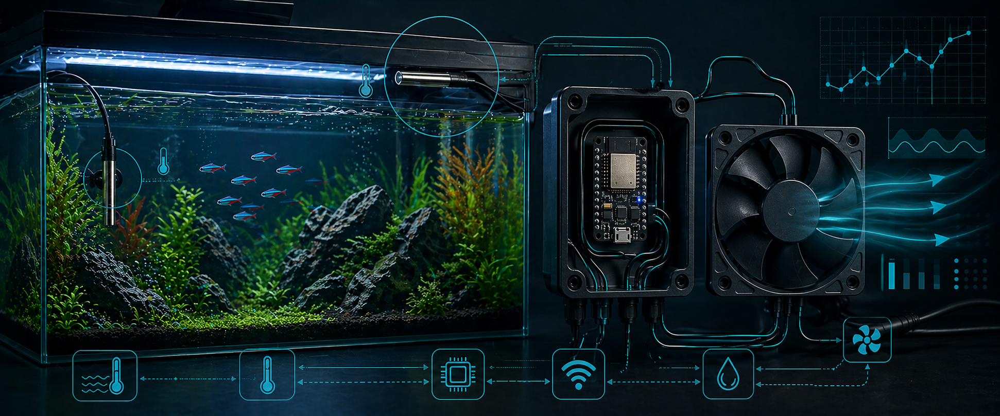

# Aquarium Cooling Controller

[](https://github.com/TeeVau/aquarium-cooling-controller)
[](https://github.com/TeeVau/aquarium-cooling-controller)
[](https://github.com/TeeVau/aquarium-cooling-controller/tree/main/firmware)
[](https://github.com/TeeVau/aquarium-cooling-controller/releases)
[](https://github.com/TeeVau/aquarium-cooling-controller/blob/main/LICENSE)
[](https://teevau.github.io/aquarium-cooling-controller/)

ESP32 firmware for autonomous aquarium cooling with a 4-pin PWM fan, one
DS18B20 water-temperature sensor, MQTT telemetry, FHEM integration, and
broker-driven OTA updates.



## What It Does

The controller keeps cooling decisions local on the ESP32. Wi-Fi, MQTT, FHEM,
and OTA are useful for monitoring and maintenance, but cooling continues even
when the network is unavailable.

Current release: `0.2.0`.

Main capabilities:

- Water-temperature based staged fan control.
- Default target temperature: `23.0 C`.
- Default fan stages: `45%` for `fan-low`, `60%` for `fan-high`.
- Persistent target and staged-control settings in ESP32 Preferences / NVS.
- Fixed DS18B20 water-sensor assignment by ROM ID.
- Fan RPM monitoring with tach-based plausibility checks.
- MQTT telemetry for state, diagnostics, fault state, OTA state, and availability.
- Validated MQTT remote settings for target temperature, hysteresis, fan stages,
  and OTA enable/disable.
- FHEM `MQTT2_DEVICE` definition with status display, readings, set commands,
  and DBLog profile.
- BIN-only OTA update workflow through `tools/ota-upload.ps1`.

## Hardware

| Component | Purpose | Notes |
|---|---|---|
| ESP32 DevKit / ESP32-WROOM class board | Main controller | Built with FQBN `esp32:esp32:esp32` |
| Noctua NF-S12A PWM or compatible 4-pin PWM fan | Cooling actuator | 12 V fan supply |
| DS18B20 waterproof sensor | Water temperature | Current ROM: `28333844050000CB` |
| 12 V power supply | Fan power | Common ground with ESP32 is required |
| 12 V to 5 V buck converter | ESP32 supply | Recommended for an installed controller |
| `3.3 kOhm` pull-up | 1-Wire bus | DATA to `3.3 V` |
| `3.3 kOhm` pull-up | Tach input | TACH to `3.3 V` |

## Wiring

| Function | ESP32 GPIO | Notes |
|---|---:|---|
| Fan PWM | 25 | 25 kHz PWM output |
| Fan TACH | 26 | Tach input with `3.3 kOhm` pull-up |
| 1-Wire DATA | 33 | DS18B20 bus with `3.3 kOhm` pull-up |

Fan connector reference:

| Fan Pin | Signal | Typical Color | Project Connection |
|---|---|---|---|
| 1 | GND | Black | Common GND |
| 2 | +12 V | Yellow | 12 V fan supply |
| 3 | TACH | Green | ESP32 GPIO26 |
| 4 | PWM | Blue | ESP32 GPIO25 |

Known cable colors for the currently used potted DS18B20 sensor:

| Sensor Wire | Function |
|---|---|
| `rot` | `3.3 V` |
| `gelb` | `GND` |
| `gruen` | `DATA` |

## Install

Required software:

- Arduino IDE 2.x or compatible `arduino-cli`.
- ESP32 board package for Arduino.
- Arduino libraries `OneWire`, `DallasTemperature`, and `PubSubClient`.
- PowerShell on Windows for the repository helper scripts.
- Mosquitto command-line clients if you use the MQTT helper scripts directly.

Recommended ESP32 board package URL:

```text
https://raw.githubusercontent.com/espressif/arduino-esp32/gh-pages/package_esp32_index.json
```

Build from the repository root:

```powershell
powershell -ExecutionPolicy Bypass -File .\tools\build.ps1
```

The build script resolves Arduino CLI, writes board-scoped build output below
`.arduino-build/`, and exports a versioned firmware image below `bin/`.

## Configure Wi-Fi and MQTT

1. Copy `firmware/controller/network_config.local.example.h` to
   `firmware/controller/network_config.local.h`.
2. Set `AQ_WIFI_SSID`, `AQ_WIFI_PASSWORD`, `AQ_MQTT_HOST`, and optional MQTT
   credentials.
3. Keep `network_config.local.h` private; it is ignored by Git.
4. Build and flash the firmware.
5. Use the serial `network` command or FHEM readings to verify connectivity.

The committed default MQTT root topic is `aquarium/cooling`. The included FHEM
template uses the tested local root topic `aquarium_cooling`; change the root
in the FHEM file if your firmware uses another value.

## OTA Update

After a successful build, flash the installed controller over MQTT-assisted OTA:

```powershell
powershell -ExecutionPolicy Bypass -File .\tools\ota-upload.ps1
```

The OTA script:

- selects the newest versioned BIN from `bin/`,
- enables the temporary OTA maintenance window over MQTT,
- reads the controller-published upload URL,
- uploads the BIN image,
- waits for the reboot,
- verifies MQTT `availability=online`,
- verifies the reported `firmware_version`.

For normal releases, do not pass `-UploadUrl` and do not use manual HTTP upload
commands. Let the script discover the active OTA endpoint through MQTT.

## FHEM Integration

The repository includes a ready-to-import FHEM `MQTT2_DEVICE` definition:

```text
integrations/fhem/aquarium-cooling-mqtt2-device.cfg
```

The template creates readings for controller state, diagnostics, fault policy,
network status, OTA state, and remote-configuration feedback. It also exposes
validated `setList` controls for:

- `target_temp_c`
- `cooling_on_delta_c`
- `cooling_off_delta_c`
- `high_cooling_delta_c`
- `fan_low_pwm_percent`
- `fan_high_pwm_percent`
- `ota_enable`

The current field profile for the 120-liter installation uses:

```text
attr AquariumCooling event-on-change-reading .*
attr AquariumCooling event-min-interval .*:1800
attr AquariumCooling DbLogInclude water_temp_c:1800,target_temp_c:86400,fan_pwm_percent:300,controller_mode,fan_fault,alarm_code,fault_severity,fault_response,availability
```

Use the FHEM integration notes for installation and customization:

```text
integrations/fhem/README.md
```

## MQTT Topics

State topics:

| Topic suffix | Payload |
|---|---|
| `/state/water_temp_c` | Water temperature or `unavailable`, one decimal place |
| `/state/target_temp_c` | Active target temperature, one decimal place |
| `/state/cooling_on_delta_c` | Fan-on delta in Celsius |
| `/state/cooling_off_delta_c` | Fan-off delta in Celsius |
| `/state/high_cooling_delta_c` | Fan-high delta in Celsius |
| `/state/fan_low_pwm_percent` | Active low-stage PWM |
| `/state/fan_high_pwm_percent` | Active high-stage PWM |
| `/state/fan_pwm_percent` | Final commanded fan PWM |
| `/state/fan_rpm` | Measured fan speed |
| `/state/controller_mode` | `fan-off`, `fan-low`, `fan-high`, or `water-sensor-fallback` |

Status and diagnostics include RPM plausibility values, fault state,
`firmware_version`, `network_ip`, OTA state, remote-config result readings, and
`availability`.

Remote settings use `/set/...` topics with validated payloads. Invalid values
are rejected and do not overwrite persisted settings.

## Serial Service

Serial monitor settings:

```text
115200 baud
```

Commands:

| Command | Effect |
|---|---|
| `status` | Print current diagnostics |
| `target <c>` | Persist a custom target temperature |
| `default` | Reset target temperature to `23.0 C` |
| `control` | Print active staged-control settings |
| `faults` | Print fault-policy defaults |
| `network` | Print Wi-Fi/MQTT status |
| `publish` | Publish MQTT telemetry immediately |
| `ota status` | Print OTA state |
| `ota enable` | Open the temporary OTA window |
| `ota cancel` | Close the OTA window |
| `help` | Show command list |

## Repository Layout

| Path | Purpose |
|---|---|
| `firmware/controller/` | Main ESP32 controller firmware |
| `integrations/fhem/` | FHEM MQTT2 integration |
| `tools/` | Build, MQTT, OTA, and serial helper scripts |
| `docs/aquarium-cooling-controller-fsd.md` | Development FSD |
| `docs/design/` | Architecture and wiring diagrams |
| `docs/aquarium-live-tests/` | Archived field-test data |
| `docs/result fan test/` | Archived fan-characterization data |
| `bin/` | Versioned firmware binaries created by the build script |

## Troubleshooting

### Fan Does Not Run

- Verify common ground between ESP32, fan, and `12 V` supply.
- Check fan PWM on GPIO25.
- Confirm fan power is present on the 12 V line.
- Run serial `status` and inspect the active controller mode and PWM command.

### RPM Stays at Zero

- Check tach wiring on GPIO26.
- Check the `3.3 kOhm` tach pull-up to `3.3 V`.
- Confirm the fan provides a tach output.

### Water Temperature Is Unavailable

- Check DS18B20 DATA on GPIO33.
- Check the `3.3 kOhm` 1-Wire pull-up to `3.3 V`.
- Confirm the configured water-sensor ROM matches the installed sensor.
- Verify sensor wiring: `rot = 3.3 V`, `gelb = GND`, `gruen = DATA`.

### MQTT or FHEM Does Not Update

- Run serial `network` and compare the reported root topic with the FHEM
  `readingList`.
- Confirm the broker receives `<root>/status/availability`.
- Verify the FHEM `IODev` points to the correct MQTT2 device.
- Check `remote_config_last_result`, `remote_config_last_key`, and
  `remote_config_last_detail` after sending a FHEM command.

### OTA Fails

- Run `tools/ota-upload.ps1` from the repository root.
- Confirm MQTT is online before starting OTA.
- Confirm the build produced a newer versioned BIN in `bin/`.
- Do not use `-UploadUrl` unless you are explicitly troubleshooting the raw
  HTTP endpoint.

## Project Links

- Releases: <https://github.com/TeeVau/aquarium-cooling-controller/releases>
- API documentation: <https://teevau.github.io/aquarium-cooling-controller/>
- FSD: [docs/aquarium-cooling-controller-fsd.md](docs/aquarium-cooling-controller-fsd.md)
- FHEM integration: [integrations/fhem/README.md](integrations/fhem/README.md)
- License: [GPL-3.0](LICENSE)
