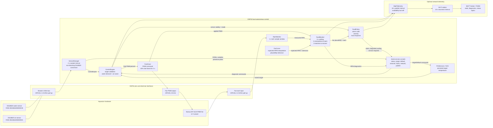
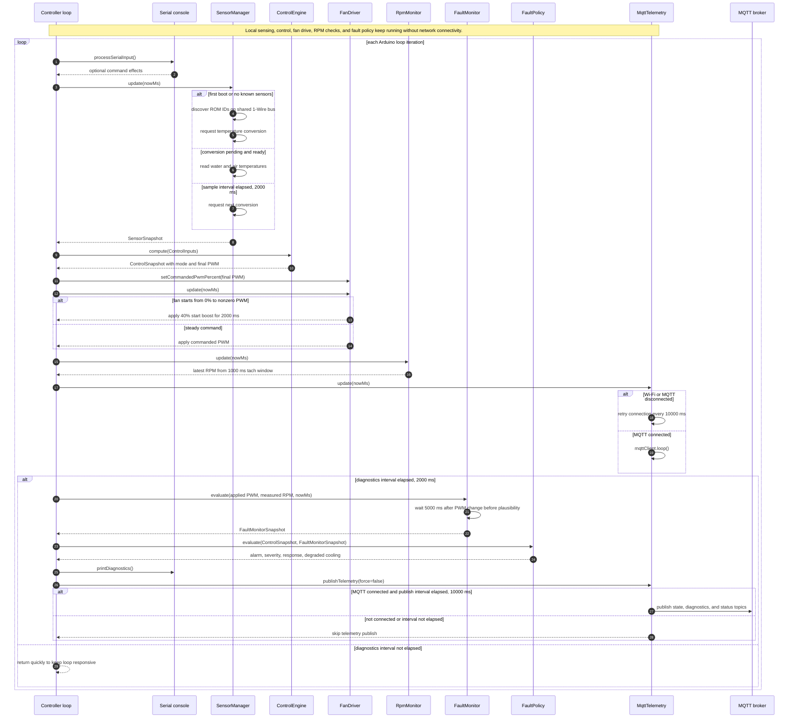

# Controller Diagrams

These Mermaid diagrams document the current controller firmware behavior in
`firmware/controller`.

The diagrams are also available as standalone `.mmd` files for draw.io /
diagrams.net imports:

- [controller-state-machine.mmd](controller-state-machine.mmd)
- [controller-system-architecture.mmd](controller-system-architecture.mmd)
- [controller-cycle-sequence.mmd](controller-cycle-sequence.mmd)

Rendering notes are available in [mermaid-rendering.md](mermaid-rendering.md).

Rendered artifacts:

- [controller-state-machine.svg](rendered/controller-state-machine.svg)
- [controller-state-machine.png](rendered/controller-state-machine.png)
- [controller-system-architecture.svg](rendered/controller-system-architecture.svg)
- [controller-system-architecture.png](rendered/controller-system-architecture.png)
- [controller-cycle-sequence.svg](rendered/controller-cycle-sequence.svg)
- [controller-cycle-sequence.png](rendered/controller-cycle-sequence.png)

## Control States

```mermaid
stateDiagram-v2
    direction LR

    state "Setup" as Setup
    state "Water control" as WaterControl
    state "Water control + air assist" as AirAssist
    state "Water sensor fallback" as WaterFallback

    [*] --> Setup
    Setup --> WaterControl: setup complete and water sample valid
    Setup --> WaterFallback: water sample invalid

    WaterControl --> AirAssist: air sample valid and air_pwm > water_pwm
    AirAssist --> WaterControl: air sample invalid or water_pwm >= air_pwm

    WaterControl --> WaterFallback: water sample invalid
    AirAssist --> WaterFallback: water sample invalid
    WaterFallback --> WaterControl: water sample valid and water_pwm >= air_pwm
    WaterFallback --> AirAssist: water sample valid and air_pwm > water_pwm

    note right of WaterControl
      ControlEngine mode: water-control
      final_pwm = water_based_pwm
      target defaults to 23.0 C when invalid
    end note

    note right of AirAssist
      ControlEngine mode: water-control+air-assist
      final_pwm = max(water_based_pwm, air_based_pwm)
      air assist starts at 26.0 C and reaches full assist at 30.0 C
    end note

    note right of WaterFallback
      ControlEngine mode: water-sensor-fallback
      final_pwm = fallback PWM 40%
      fault response: water-fallback
    end note

    state "Fault policy overlay" as FaultOverlay {
        direction LR

        state "No alarm" as NoAlarm
        state "Air sensor fault" as AirSensorFault
        state "Water sensor fault" as WaterSensorFault
        state "Fan fault" as FanFault
        state "Water sensor + fan fault" as WaterAndFanFault
        state "Air sensor + fan fault" as AirAndFanFault
        state "Multiple faults" as MultipleFaults

        [*] --> NoAlarm
        NoAlarm --> AirSensorFault: air sample invalid
        NoAlarm --> WaterSensorFault: water sample invalid
        NoAlarm --> FanFault: RPM mismatch x3

        AirSensorFault --> NoAlarm: air sample valid
        WaterSensorFault --> NoAlarm: water sample valid
        FanFault --> NoAlarm: RPM plausible x3

        AirSensorFault --> AirAndFanFault: fan fault latched
        WaterSensorFault --> WaterAndFanFault: fan fault latched
        FanFault --> AirAndFanFault: air sample invalid
        FanFault --> WaterAndFanFault: water sample invalid

        AirAndFanFault --> FanFault: air sample valid
        WaterAndFanFault --> FanFault: water sample valid

        AirSensorFault --> MultipleFaults: water sample invalid
        WaterSensorFault --> MultipleFaults: air sample invalid
        AirAndFanFault --> MultipleFaults: water sample invalid
        WaterAndFanFault --> MultipleFaults: air sample invalid
        MultipleFaults --> NoAlarm: all sensors valid and fan plausible
    }
```

## System Architecture

## Control Cycle Timing

