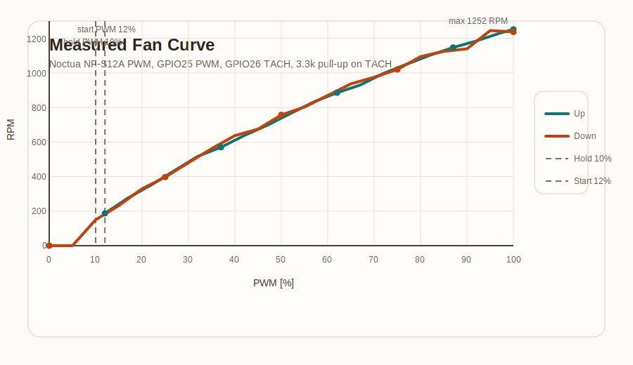

# Fan Characterization Summary

Date: `2026-04-12`

Hardware under test:

- Fan: `Noctua NF-S12A PWM`
- Controller: `ESP32` using `GPIO25` for PWM and `GPIO26` for TACH
- Tach pull-up: `3.3 kOhm` to `3.3 V`
- PWM frequency: `25 kHz`

Important wiring note:

- The successful measurements were only achieved after correcting the ground wiring.
- `ESP32 GND`, `fan GND`, and `12 V supply GND` must share a common reference.

## Result Summary

| Metric | Value |
|---|---:|
| Start PWM from standstill | `12%` |
| Minimum hold PWM while spinning | `10%` |
| RPM at 0% PWM | `0` |
| RPM at 5% PWM | `0` |
| RPM at 100% PWM | `1252` |

## Curve Visualization



## Upward Curve

```cpp
FanCurvePoint curve[] = {
  {12, 187},
  {17, 277},
  {22, 352},
  {27, 435},
  {32, 517},
  {37, 570},
  {42, 637},
  {47, 697},
  {52, 765},
  {57, 832},
  {62, 885},
  {67, 930},
  {72, 997},
  {77, 1050},
  {82, 1102},
  {87, 1147},
  {92, 1185},
  {97, 1230},
  {100, 1252},
};
```

## Downward Curve

| PWM | RPM |
|---:|---:|
| 100 | 1237 |
| 95 | 1245 |
| 90 | 1140 |
| 85 | 1125 |
| 80 | 1095 |
| 75 | 1020 |
| 70 | 975 |
| 65 | 937 |
| 60 | 870 |
| 55 | 802 |
| 50 | 757 |
| 45 | 675 |
| 40 | 637 |
| 35 | 562 |
| 30 | 480 |
| 25 | 397 |
| 20 | 330 |
| 15 | 232 |
| 10 | 150 |
| 5 | 0 |
| 0 | 0 |

## Source Logs

- [`fan-curve-chart.svg`](./fan-curve-chart.svg)
- [`live-run.txt`](./live-run.txt)
- [`live-run-part2.txt`](./live-run-part2.txt)
- historical comparison:
  - [`with pullup.txt`](./with%20pullup.txt)
  - [`without pullup.txt`](./without%20pullup.txt)
